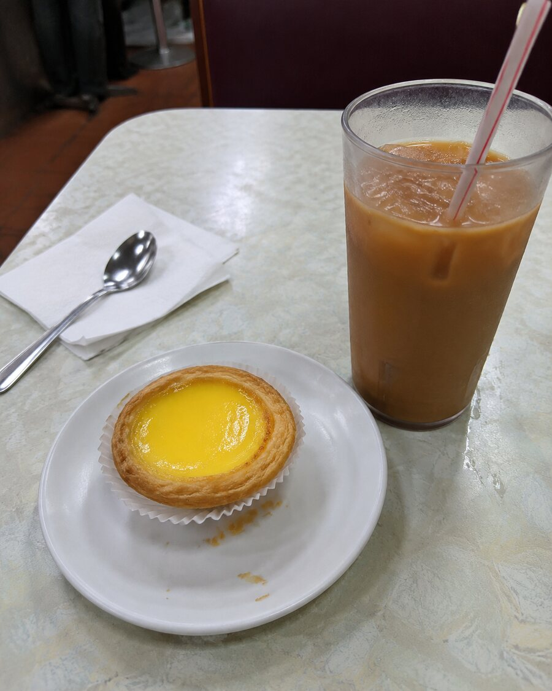
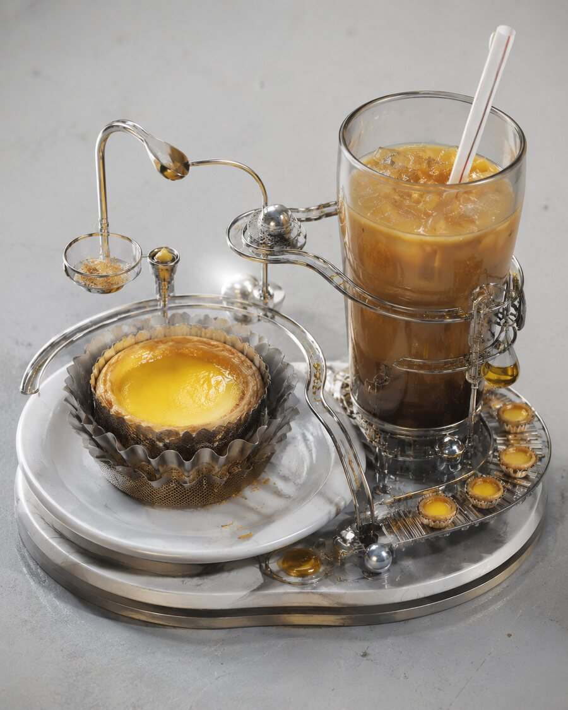

# B.B.BAM Aesthetic Skills

把随手拍中的原有结构，唤醒成一个有主体、有情绪、可以进入的清透人工世界。

> 不是滤镜，也不是给所有照片套上同一种玻璃未来感。每个 Skill 都从原图中寻找自己的路径、结构和情绪机关。

## 先看效果，再选 Skill

### 01 · 国风空间 × 游乐回路

**`bbbam-shanshui-circuit`** · 把原图中的山脊、海岸、道路、栏杆、河流或建筑边缘，重组为一条可以游玩的当代山水回路。

| 原图 | 生成图 |
|---|---|
|  |  |

它不是在风景上添加亭台、灯笼和花，而是让原图已有的空间关系变成“游乐机制”：路径可以滑行、环绕、穿越或浮起；国风来自山水层次、留白、借景和曲折动线。

**适合：** 风景、海湾、公园、街道、建筑、旅行随手拍、城市边缘。

**调用：** `Use $bbbam-shanshui-circuit to transform this photo.`

---

### 02 · 日常供物机器 / Offering Machine

**`bbbam-offering-machine`** · 把食物、饮品、礼物或日常小物变成一个有情绪价值的供物机器：原物是能量核心，包装、吸管、边缘、蒸汽与倒影成为它自己的机关。

| 原图 | 生成图 |
|---|---|
|  |  |

它不是普通产品精修，也不是把物品塞进复杂机器。每次只选择一种情绪引擎——安慰、奖励、庆祝、怀念、渴望或日常仪式——再用原物已有结构让它发生。

**适合：** 甜品、饮品、伴手礼、玩具、化妆品、桌面小物、生活随手拍。

**调用：** `Use $bbbam-offering-machine to transform this photo.`

## 怎么选

| 你的原图或目标 | 选择 |
|---|---|
| 想让一个地方变成可进入、可游玩的空间 | `bbbam-shanshui-circuit` |
| 想让一个物品成为有情绪的核心装置 | `bbbam-offering-machine` |
| 原图最强的是道路、岸线、栏杆、山脊、河流 | `bbbam-shanshui-circuit` |
| 原图最强的是食物、杯子、包装、手柄、蒸汽、配件 | `bbbam-offering-machine` |

## 共同的 B.B.BAM 审美内核

- **从原图生长：** 每一个重要新增结构都必须能回指原图中的元素。
- **一个强主体：** 缩略图里一秒看懂主角，其他元素只负责承托。
- **有趣胜过滤镜：** 改变物体或空间的角色、尺度与行为，而不只是调色和换材质。
- **清透但不单一：** 明亮、轻盈、颜色关系清楚；透明与金属只是可选口音，不是统一答案。
- **多彩但不五颜六色：** 最多四种颜色角色、三类材质，保留留白与呼吸感。
- **当代而非符号堆砌：** 国风来自空间秩序，不靠随机的亭台、花草、龙凤或书法。

## 安装一个或两个 Skill

每个子目录都是独立 Skill。将需要的目录安装到你的 Skills 目录即可：

```text
skills/
├── bbbam-shanshui-circuit/
└── bbbam-offering-machine/
```

你可以只安装一个，也可以两个都安装；它们使用统一前缀，但保留独立触发条件、转换规则和质量检查。

## 使用建议

上传一张原图后直接点名 Skill，并补充你最想保留的东西：

```text
Use $bbbam-shanshui-circuit.
保留海湾视角和山体轮廓，让岸线变成一条清透、可进入的游乐回路。
```

```text
Use $bbbam-offering-machine.
保留蛋挞的食欲感和奶茶的识别度，把它们变成“奖励 + 日常仪式”的供物机器。
```

Skill 会先检查原图是否适合，再生成“原图 → 生成图”对照，并说明哪些结构被转化、哪些内容被保留。

## Repository Structure

```text
bbbam-aesthetic-skills/
├── README.md
└── skills/
    ├── bbbam-shanshui-circuit/
    │   ├── SKILL.md
    │   ├── agents/openai.yaml
    │   ├── references/
    │   └── assets/
    └── bbbam-offering-machine/
        ├── SKILL.md
        ├── agents/openai.yaml
        ├── references/
        └── assets/
```
